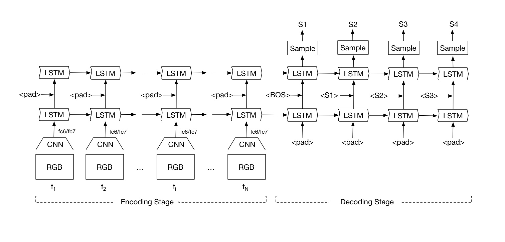

# VideoCaption
Video captioning using LSTM and CNN following the paper [sequence to sequence - video to text](http://arxiv.org/abs/1505.00487). This is the Visual Learning project done by Rui Zhang, Yujia Huang and Yu Zhang. [Neuraltalk2](https://github.com/karpathy/neuraltalk2) for [Karpathy](https://github.com/karpathy) is taken as inference.

##Model
As states in the paper, the model can be divided into two parts: encoder and decoder. Encoder and Decoder share the same architecture but frames are fed into the framework and outputs are ignored during encoding while both frames and words get fed into the framework and output taken as final output during decoding.

